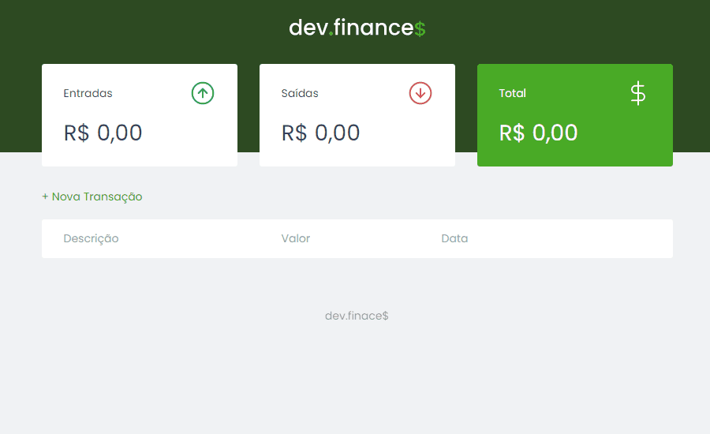

<h1 align="center">
  
</h1>

<p align="center">
  
</p>

<div align="center">
  
</div>

---

## 💡 Sobre o Projeto

Este projeto foi desenvolvido no evento Maratona Discover pela [Rocketseat](https://rocketseat.com.br/) 🚀&nbsp;💜
O dev.finances é um projeto para calcular o fluxo de caixa, suas entradas e saídas financeiras.

---

## 🚀 Tecnologias e ferramentas utilizadas

- **HTML5**
- **CSS3**
- **JavaScript**

---

## 🔧 Instruções para visualizar o projeto

```bash
# Clone o repositório
git clone https://github.com/willnogueyra/dev-finances


# Entre no diretório
cd dev-finances


# Abra com seu editor (ex: VSCode)
code .
```

Depois disso, utilize uma ferramenta como o [Live Server](https://marketplace.visualstudio.com/items?itemName=ritwickdey.LiveServer) para criar um servidor local e executar o projeto.

---

Feito por 💜&nbsp; William Nogueira 👋 &nbsp;[linkedin](https://www.linkedin.com/in/william-nogueira-870a98190/)
